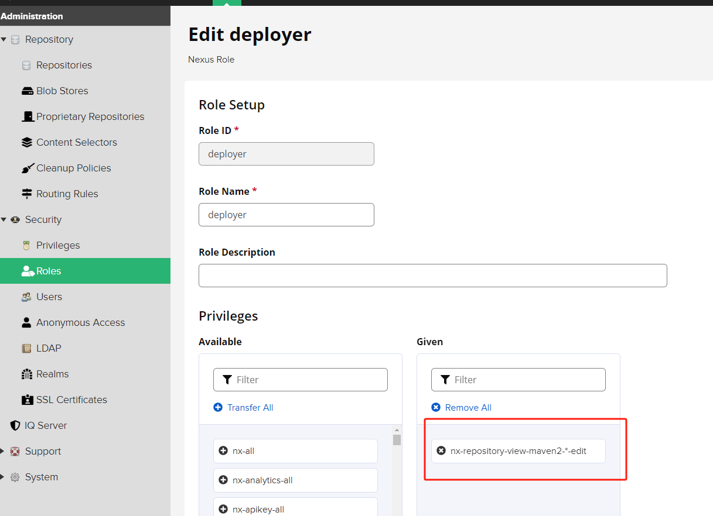
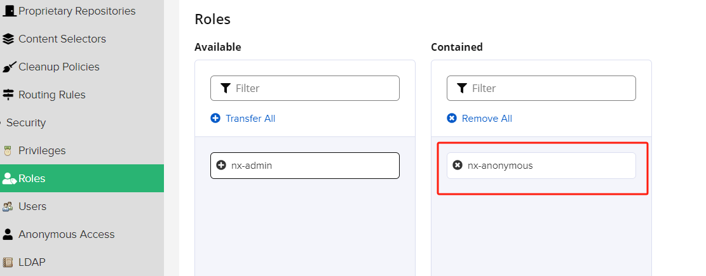
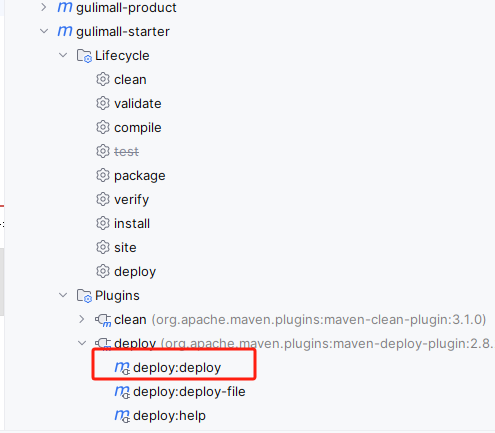

## 开发环境安装

- 安装docker

```shell
// 安装yum源的工具包
yum install -y yum-utils

// 配置docker的安装源
yum-config-manager \
--add-repo \
https://download.docker.com/linux/centos/docker-ce.repo

// 安装docker
yum install docker-ce docker-ce-cli containerd.io docker-compose-plugin -y

// 设置开机自启
systemctl enable docker

// 配置阿里云的镜像源，帮助文档： https://cr.console.aliyun.com/cn-hangzhou/instances/mirrors
mkdir -p /etc/docker
tee /etc/docker/daemon.json <<-'EOF'
{
"registry-mirrors": ["https://hpifphoh.mirror.aliyuncs.com"]
}
EOF

// 重启服务
systemctl daemon-reload
systemctl restart docker

```

- 安装nexus

```shell
docker pull sonatype/nexus3

mkdir -p /mydata/nexus/data
chmod 777 -R /mydata/nexus

docker run -d --name nexus -p 8081:8081 \
--restart always \
-v /mydata/nexus/data:/nexus-data sonatype/nexus3

# 查看日志，看是否启动完成
docker logs -f nexus

# 启动后，查看自动生成的admin的密码
cat /mydata/nexus/data/admin.password

# 浏览器访问，然后登陆，用户名admin
修改密码： root1003 
设置为可以匿名访问
```

- 安装MySQL

```shell
# 拉取镜像
docker pull mysql:5.7

# 把镜像中的配置文件拷贝到本地
docker cp mysql:/etc/mysql/my.cnf /mydata/mysql/conf/my.cnf

# 启动
docker run -p 3306:3306 --name mysql \
--restart always \
-v /mydata/mysql/log:/var/log/mysql \
-v /mydata/mysql/data:/var/lib/mysql \
-v /mydata/mysql/conf/my.cnf:/etc/mysql/my.cnf \
-v /etc/localtime:/etc/localtime \
-e MYSQL_ROOT_PASSWORD=root \
-d mysql:5.7
```

- 安装Redis

```shell
docker pull redis

docker run -p 6379:6379 --name redis \
--restart always \
-v /mydata/redis/data:/data \
-v /mydata/redis/conf/redis.conf:/etc/redis/redis.conf \
-d redis redis-server /etc/redis/redis.conf

```

## 导入SQL

把 doc/sql 目录下的sql全部导入到安装好的MySQL中。

## 使用Nexus私服

为了统一管理依赖的版本，引入gulimall-starter模块，此模块中只有一个pom文件，里面规定了SpringBoot、SpringCloud和SpringCloud-Alibaba的版本。

这样做的好处是，当开发团队有多个小组，每一个小组都只负责其中一个模块时，可以让单个小组只需下载自己负责的功能模块即可，不是自己负责的模块，不需要下载。

- 设置nexus





- 修改gulimall-starter的pom文件

```xml
    <!--添加发布插件的依赖-->
    <distributionManagement>
        <repository>
            <id>releases</id>   <!-- 这里的id要和settings.xml中server部分中配置的id保持一致 -->
            <url>http://192.168.1.110:8081/repository/maven-releases/</url>
        </repository>
        <snapshotRepository>
            <id>snapshots</id>  <!-- 这里的id要和settings.xml中server部分中配置的id保持一致 -->
            <url>http://192.168.1.110:8081/repository/maven-snapshots/</url>
        </snapshotRepository>
    </distributionManagement>
```

- 修改maven的settings.xml文件

```xml

    <servers>
        <server>
            <id>releases</id>
            <username>zeanzai</username>
            <password>root1003</password>
        </server>
        <server>
            <id>snapshots</id>
            <username>zeanzai</username>
            <password>root1003</password>
        </server>
    </servers>

    <profile>
        <id>dev</id>
        <repositories>
            <repository>
                <id>nexus</id>
                <url>http://192.168.1.110:8081/repository/maven-public/</url>
                <releases>
                    <enabled>true</enabled>
                </releases>
                <snapshots>
                    <enabled>true</enabled>
                </snapshots>
            </repository>
        </repositories>
        <pluginRepositories>
            <pluginRepository>
                <id>public</id>
                <name>Public Repositories</name>
                <url>http://192.168.1.110:8081/repository/maven-public/</url>
            </pluginRepository>
        </pluginRepositories>
    </profile>
```

- 把gulimall-starter推送到nexus上



- 其他模块中引入依赖

```xml
<parent>
    <groupId>com.atguigu.gulimall</groupId>
    <artifactId>gulimall-starter</artifactId>
    <version>0.0.1-SNAPSHOT</version>
    <relativePath /> <!--查找顺序： relativePath元素中的地址–>本地仓库–>远程仓库，设定一个空值将始终从仓库中获取，不从本地路径获取。-->
</parent>
```

## 安装idea插件

- easycode

安装完成之后，把生成的代码导入到模块中。


## 说明

1. nacos上创建dev命名空间，并修改dataid，之后导入 doc/nacos-config-files/nacos_config_export_20240204121102.zip ；
2. gulimall-product项目中使用了nacos-config，目的是学习nacos，其他项目中暂时不使用；
2. gulimall-common为公共依赖模块，也可以把它放到私服上去，这样的话，其它团队中就可以直接使用这个模块的即可，并且工程的主pom文件中也无需引入。


# 谷粒商城

## 架构的模型

1。 调整视频教程中的项目模块组织方式；
2。 每一个模块的parent模块都是springboot，
3。 把其他模块中用到的公共依赖迁移到common工程中去，这样可以使得一些依赖能够被统一管理起来；


## nacos

使用的版本： 1.2.1
使用的springboot版本：  2.3.2.RELEASE
使用的springcloud版本：  Hoxton.SR6
使用的springcloud-alibaba版本： 2.2.1.RELEASE

1。 把coupon模块接入nacos，并利用不同的group和共享配置使用nacos 
2。 创建gateway模块，并接入nacos，同时利用共享配置方式使用nacos


## 把renren-fast注册到nacos注册中心

1. pom中添加 gulimall-common 的依赖
2. 修改springboot的版本： 2.3.2.RELEASE  不修改会报 配置不正确 的错误信息；
3. 配置文件中添加 discovery 的配置信息
4. 启动类上添加 @EnableDiscoveryClient 的注解

## mybatis-plus逻辑删除

1。 挑选数据库表中某一个字段作为逻辑删除字段
2。 在这个表的entity的这个字段上添加  @TableLogic(value = "1", delval = "0") 
3。 重写service


## JSR303


## 参考资料

1。 源代码： https://gitee.com/leifengyang/gulimall
2。 elememt： https://element.eleme.cn/#/zh-CN
3。 spring官网： https://spring.io/projects/spring-cloud
4。 spring旧版本指导手册： https://docs.spring.io/spring-cloud/docs/
5。 如何查看spring旧版文档： https://blog.csdn.net/weixin_42091529/article/details/113694682
6。 mybatis-plus官网： https://baomidou.com/pages/6b03c5/#%E4%BD%BF%E7%94%A8%E6%96%B9%E6%B3%95


## 测试git连通性

提交


